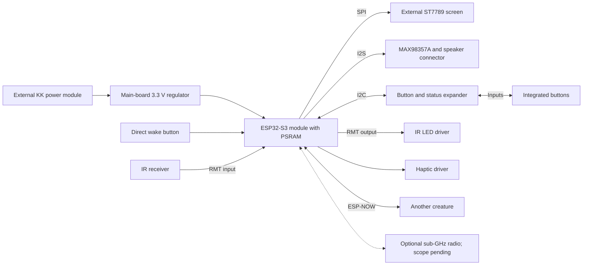

# Archived proposal — superseded by the 2026-09-10 brief

Historical only: large WROOM module, eight-button mapping and optional sub-GHz are NOT the current design. See ../ARCHITECTURE.md.

Status: candidate for review. Pin and part selections are not released for manufacture.

User decision: ESP32-S3 with PSRAM accepted. Specific module variant proposed: ESP32-S3-WROOM-1-N16R8.

## Hardware partition

Keep the MCU's approved RF module, flash, and PSRAM together on the main PCB, rather than reproducing a Super Mini development board. Integrate audio, IR and haptic driver electronics, button inputs, decoupling, reset/boot controls, programming access, and local regulation. Display, battery, and charger/protection board remain external.

The `gpio_candidate.csv` option uses an S3 plus a 16-bit TCA9535-class expander. Seven game buttons use the expander; Start/wake connects directly to RTC-capable GPIO4. This leaves direct GPIOs for IR timing and future SPI peripherals. Include pull-ups and firmware debounce; choose the exact package after placement planning. See [TI TCA9535](https://www.ti.com/product/TCA9535) and [Espressif sleep modes](https://docs.espressif.com/projects/esp-idf/en/stable/esp32s3/api-reference/system/sleep_modes.html).

Candidate expander mapping: P00 UP, P01 DOWN, P02 LEFT, P03 RIGHT, P04 A, P05 B, P06 SELECT, P07 spare; P10 conditioned PG, P11 conditioned STAT1, P12 conditioned STAT2; remaining pins spare. Default all to inputs; add external pull-ups where needed. Poll buttons on a bounded schedule during gameplay; use INT as a notification, not an IR capture source. Only the direct wake button is initially promised to wake from deep sleep.

The candidate map reserves a shared SPI bus for optional storage and radio. Each device needs a separate CS with an inactive reset pull. Sharing must be validated for MISO release, clock mode, and display/DMA bus scheduling. A second SPI bus may be preferable if sub-GHz timing requirements demand it. No radio band or antenna has been selected.

## Feature boundary

- Pet trading: encrypted paired ESP-NOW unicast between devices, with on-screen consent. Nearby Wi-Fi infrastructure is unnecessary.
- Phone configuration: optional BLE service. Schedule radio use to manage battery consumption and shared-radio/channel constraints.
- IR: separate transmitter and demodulating receiver; useful for creature interactions and supported remote-control protocols.
- Sub-GHz RF: requires an additional transceiver, matching network, and band-appropriate antenna. ESP32 Wi-Fi/BLE hardware does not cover 315/433/868/915 MHz. Scope remains pending.
- Games: small original 2D titles with directional pad, A/B, Start/Select, sprite/tile graphics, and simple sound.
- User apps: interpretation of the user's wording is small C/C++ applications; confirm if another language was intended.

ESP-NOW supports encrypted peers, but its send callback is not proof that the receiving application saved a trade. The protocol needs application acknowledgements. Both peers must operate on a compatible Wi-Fi channel. See [Espressif ESP-NOW documentation](https://docs.espressif.com/projects/esp-idf/en/stable/esp32s3/api-reference/network/esp_now.html).

## Pet and application software

Build a firmware-owned launcher and services for input, display, audio, saves, time, power management, and pet trading. Built-in games use a small C API. Keep DMA-sensitive buffers in suitable internal memory; use PSRAM for large graphics/assets where supported.

For separately installable C apps, prototype a WebAssembly runtime and narrow host API. C source is compiled on the developer's computer; users install the resulting package. Espressif's [ESP-WASMachine](https://github.com/espressif/esp-wasmachine) provides an S3-supported experimental starting point, not a finished app platform. Validate speed and memory before adopting it. Do not assume arbitrary native binaries or source files can be dropped onto the board and executed automatically.

Provide each app a bounded memory/time budget and private save space. Apps request drawing, audio, and approved communications through host functions. Pet ownership and system settings remain firmware-owned. A VM is only as isolated as its host bindings; imports must not expose unrestricted memory, storage, or system calls.

App packages need an ID, API version, entry point, memory limit, asset manifest, and checksum. Store the trusted pet database separately from replaceable app assets. Keep recoverable firmware update slots and a physical recovery path. Exact flash partitions follow measured firmware size and selected flash capacity.

## Reliable trades

Each pet has a stable unique ID and versioned state. A trade records a transaction ID, peer IDs, offered pet IDs, and state digests. Both devices must confirm the same offer on-screen before committing.

Persist the pending transaction and lock offered pets before sending a commit request. Record receipt durably before acknowledging it. Use idempotent messages and a restartable reconciliation process so retries do not repeat transfers. Keep a prepared/in-doubt trade locked until the peer reconnects or an explicit recovery procedure resolves it; a timeout alone must not roll back a transaction that the other peer may already have committed. Fault-test power loss at every state transition.

This protects against ordinary packet loss and crashes. It does not guarantee a cheating-proof economy against an owner who modifies firmware or restores old flash backups; that would need an additional trust design.

## Display and battery targets

Resolution is not confirmed from the ST7789 controller name. As an example, a 240x280 RGB565 framebuffer is 134400 bytes; two are 268800 bytes. At 30 full frames/s, pixel payload alone is 32.26 Mbit/s. Partial updates, sprites, and sensible frame pacing reduce traffic and energy. These are calculations, not claims about the user's exact screen or achieved frame rate.

Use backlight dimming, amplifier shutdown, motor duty limits, and short radio activity windows. Keep the pet simulation event-driven and checkpoint state at meaningful transitions rather than every frame. Light/deep sleep can retain useful timekeeping while powered; elapsed real time across a hard power disconnect requires an independently powered RTC or later time synchronization. Battery life must be measured with the chosen cell and screen.

## Schematic and layout sequence

1. Confirm the main board outline, button geometry, exact screen connector, processor, and radio scope.
2. Close the power interface/current budget, including the existing output-switch limit.
3. Draw regulator, processor/USB/reset, controls/status, display, audio, IR, and haptic sheets.
4. Verify parts, pin mapping, default states, and all cross-domain/off-state interfaces.
5. Place antenna and mechanical parts first; preserve ground and RF keepouts.
6. Route, review ERC/DRC and manufacturing output, then test an integrated prototype for RF, audio, temperature, and runtime.

Completion of the architecture documents does not mean these later implementation steps have passed.
